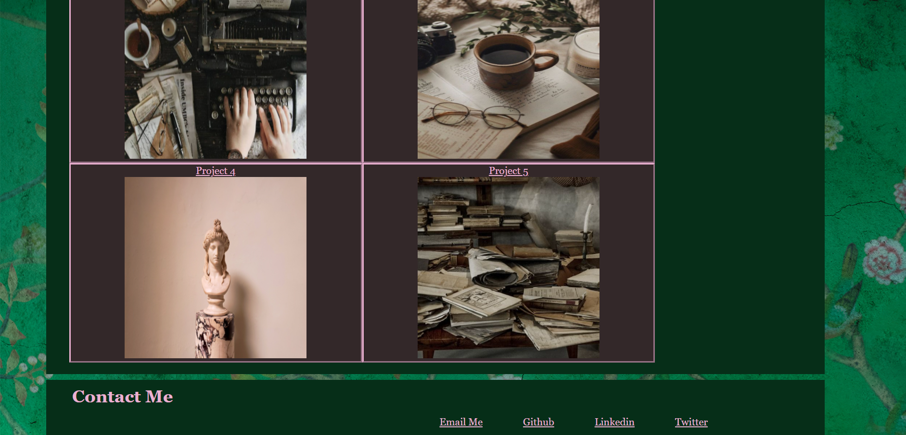

# Personal Portfolio

 My personal objective in regard to this project was to create a whole new web page from scratch to start the foundation for showing off my coding skills. 

I created an html fairly easily, but the css flexbox features gave me a heck of a time. I think if I had time to start it all over, I might. In the end I could not get one single image to format properly at smaller browser widths and ran out of time to fix the issue. 

 The time spent on the project taught me most of the basics of flexbox. 

 
 

## Click the links below to access the page and repository respectively.
 

 - [Personal Portfolio Page](https://andis90.github.io/Portfolio-Strickland)
 

 - [Personal Portfolio Repository](https://github.com/AndiS90/Portfolio-Strickland)
 

 

## **Credits**
 [MDN Flexbox](https://developer.mozilla.org/en-US/docs/Learn/CSS/CSS_layout/Flexbox)

 

### [License](./assets/License.txt)

 
